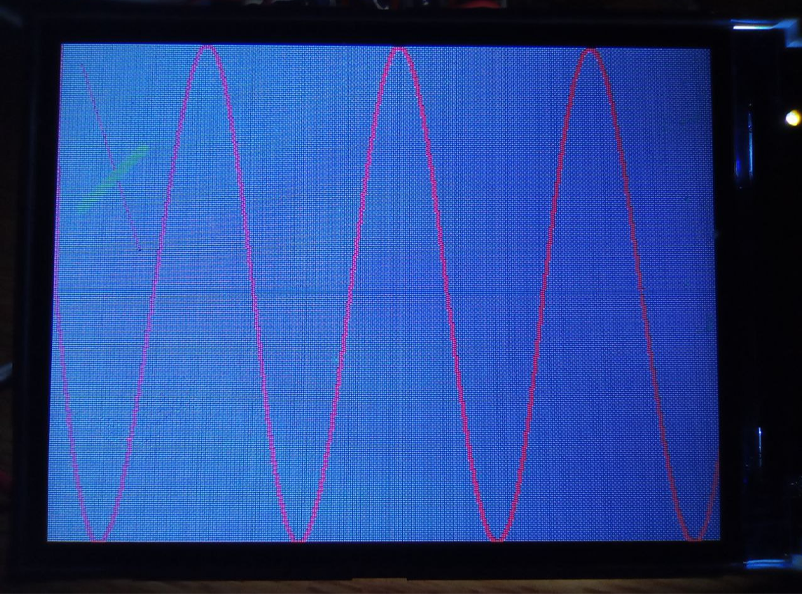
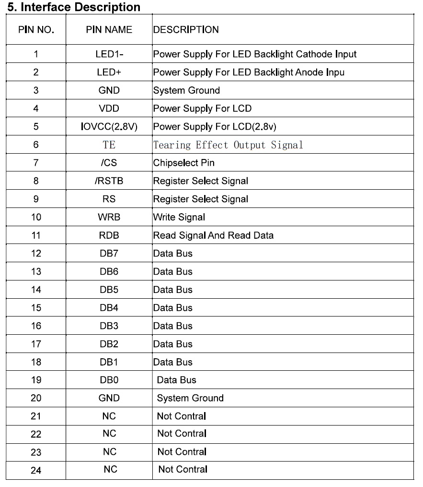
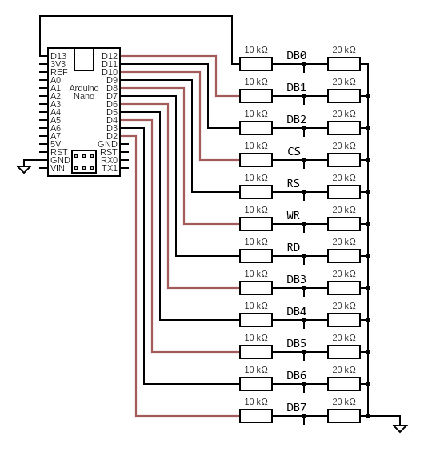

# TFTLCDST7789V
Arduino nano TFT LCD ST7789V 24pin very lightweight high level api (software "driver" for using LCD to use directly)

| Tables        | Are           | 
| ------------- | -------------| 
| Controller      | ST7789V      | 
| Interface |MCU   8Bit,FPC 24PIN,Pitch:1.0mm| 

 

# Example
```cpp
#include <Arduino.h>
#include "TFTLCDST7789V.h"

TFTLCDST7789V* lcd = new TFTLCDST7789V();

void setup() {
    lcd->init();
}

void loop() {
    lcd->setColor(255, 0, 0);
    lcd->setLineWidth(1);
    lcd->drawLine(10, 10, 40, 100);


    lcd->setColor(0, 255, 0);
    lcd->setLineWidth(4);
    lcd->drawLine(10, 80, 40, 50);

    lcd->setLineWidth(2);
    // draw sine
    int prev = 0;
    for (int i = 0; i < 360; i++) {
        double val = sin(i / 15.0) * HALF_WIDTH;
        int y = val + (240 / 2);


        // line
        lcd->setColor(0, 120, 120);
        lcd->drawPixel(i, HALF_WIDTH);
        
        // sine
        lcd->setColor(255, 0, 0);
        lcd->drawLine(i - 1, prev, i, y);
        prev = y;
    }
}
```
#### example work

#


A step-down converter 5v -> 2.8 or 3.3v is required for power supply

## Circuit

